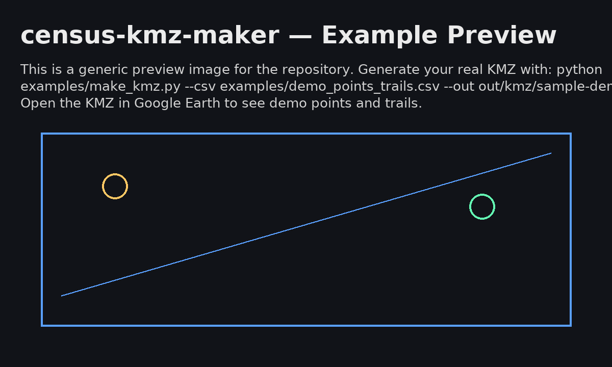

[](https://github.com/gordonmurray-coding/census-kmz-maker/actions/workflows/ci.yml)

<p align="left">
  <a href="https://www.python.org/">
    
  </a>
  <a href="./LICENSE">
    
  </a>
</p>

# census-kmz-maker

Create **KMZ** overlays from CSVs (households, trails, cemeteries). Designed for historical & genealogical mapping.

## Quickstart

1. Install:
   ```bash
   python -m venv .venv && source .venv/bin/activate
   pip install -r requirements.txt
   ```

2. Build a KMZ from the demo CSV:
   ```bash
   python examples/make_kmz.py --csv examples/demo_points_trails.csv --out out/kmz/alamance-1850.kmz
   ```

## Repository Structure

```
.
├── kmz_maker/                 # library code
├── examples/                  # demo CSV + script
├── requirements.txt
├── .gitignore
└── README.md
```

## Requirements

- Python **3.10+**
- Google Earth (to view KMZ)

## License

This project is licensed under the [MIT License](./LICENSE).


## Example Output


